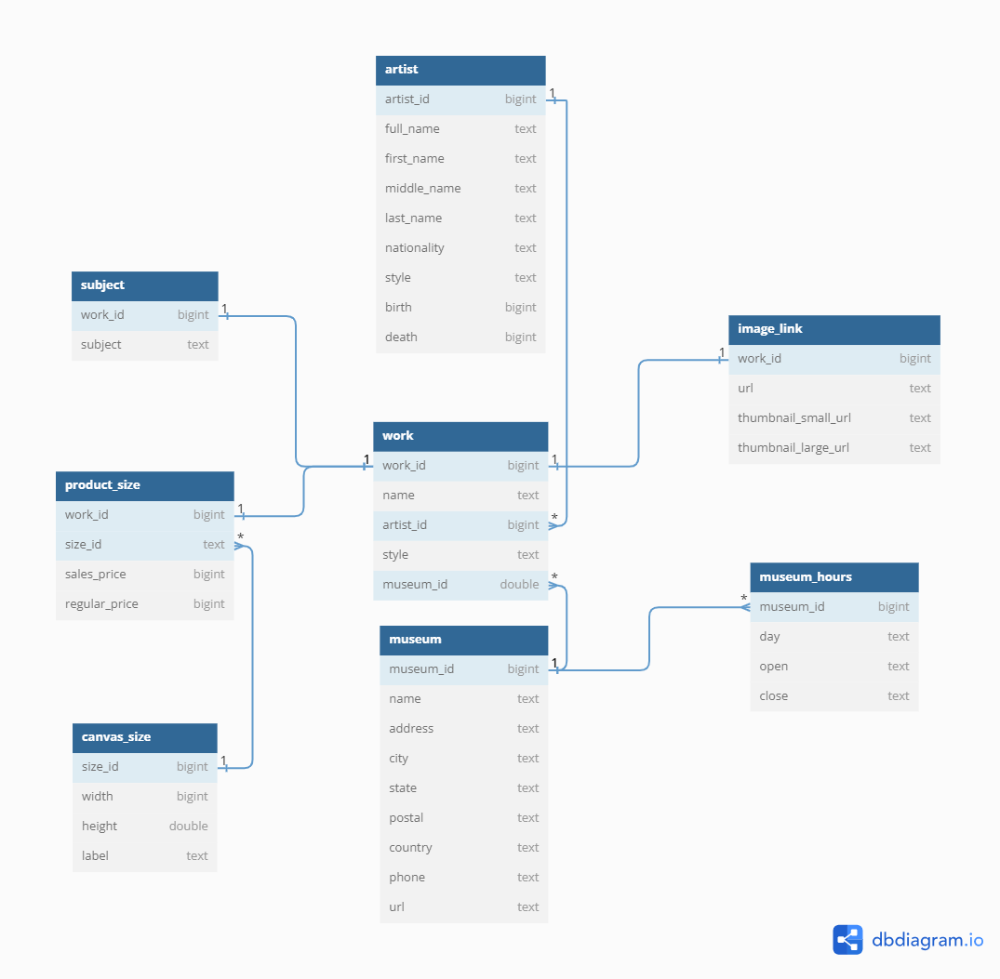

# 🎨 Painting Database Case Study with SQL

<p align="center">
  
</p>

## 📖 Overview  
This project focuses on analyzing a dataset of famous paintings using SQL. The goal is to extract meaningful insights about paintings, artists, museums, and other related data. By leveraging SQL queries, we aim to answer specific questions and uncover trends within the dataset.
## 🗂️ Dataset Description  
- **Source**: [Famous Paintings Dataset on Kaggle](https://www.kaggle.com/datasets/mexwell/famous-paintings)  
- **Number of Records**: Multiple tables with thousands of records  
- **Tables**:  
  - `artist`: Contains details about artists, including their names, nationality, and lifespan.  
  - `work`: Represents paintings, including their names, styles, and associated museums.  
  - `museum`: Information about museums, including their location and contact details.  
  - `museum_hours`: Operating hours of museums.  
  - `product_size`: Pricing details for paintings based on canvas size.  
  - `canvas_size`: Dimensions and labels for canvas sizes.  
  - `subject`: Subjects or themes of paintings.  
  - `image_link`: URLs for painting images.  

- **Data Cleaning Performed**:  
  - Removed duplicate records  
  - Corrected misspelled entries (e.g., "Thusday" ➝ "Thursday")  
  - Ensured referential integrity between tables
   
##  ER Diagram
<p align="center">
  
</p>


## 🎯 Objectives  
- **Key Questions**:  
  - Which paintings are not displayed in museums?  
  - Which museums have the most paintings?  
  - Who are the most popular artists?  
  - What are the most popular painting styles?  

- **Techniques Used**:  
  - Aggregations  
  - Joins  
  - Subqueries  
  - Window functions  
  - Common Table Expressions (CTEs)  
  - CASE statements

## 🛠️ Tools & Technologies Used  
- **SQL Dialect**: PostgreSQL  
- **Platform**: pgAdmin  
- **Other Tools**:  
  - Excel (for data cleaning)  
  - Python (for importing CSV data into the database)

## 🔍 Analysis / Key Queries

**Joins**
```sql
SELECT w.name AS painting, a.full_name AS artist, m.name AS museum  
FROM work w  
JOIN artist a ON w.artist_id = a.artist_id  
JOIN museum m ON w.museum_id = m.museum_id;
```

**Subqueries**
```sql
WITH cte AS (  
  SELECT style, COUNT(*) AS num_paintings, RANK() OVER (ORDER BY COUNT(*) DESC) AS rank  
  FROM work  
  GROUP BY style  
)  
SELECT style  
FROM cte  
WHERE rank = 1;
```

**Aggregations**
```sql
SELECT m.name, COUNT(w.work_id) AS number_of_paintings  
FROM work w  
JOIN museum m ON w.museum_id = m.museum_id  
GROUP BY m.name  
ORDER BY number_of_paintings DESC;
```
**Ranking**
```sql
SELECT a.full_name, COUNT(w.work_id) AS num_paintings, RANK() OVER (ORDER BY COUNT(w.work_id) DESC) AS rank  
FROM work w  
JOIN artist a ON w.artist_id = a.artist_id  
GROUP BY a.full_name  
ORDER BY rank;
```
**Data Cleaning**
```sql
DELETE FROM work  
WHERE ctid NOT IN (  
  SELECT MIN(ctid)  
  FROM work  
  GROUP BY work_id  
);
```
**Window Functions**
```sql
WITH cte AS (  
  SELECT style, COUNT(*) AS num_paintings,  
         RANK() OVER (ORDER BY COUNT(*) DESC) AS most,  
         RANK() OVER (ORDER BY COUNT(*) ASC) AS least  
  FROM work  
  WHERE style IS NOT NULL  
  GROUP BY style  
)  
SELECT style, CASE   
  WHEN most IN (1, 2, 3) THEN 'Most Popular'  
  WHEN least IN (1, 2, 3) THEN 'Least Popular'  
END AS popularity  
FROM cte  
WHERE most IN (1, 2, 3) OR least IN (1, 2, 3);
```
**CASE Statements**
```sql
SELECT style,   
  CASE   
    WHEN COUNT(*) > 100 THEN 'Very Popular'  
    ELSE 'Less Popular'  
  END AS popularity  
FROM work  
GROUP BY style;
```
**CTEs**
```sql
WITH popular_styles AS (  
  SELECT style, COUNT(*) AS num_paintings  
  FROM work  
  GROUP BY style  
  ORDER BY COUNT(*) DESC  
  LIMIT 1  
)  
SELECT style, num_paintings  
FROM popular_styles;
```
**Top 5 Most Popular Museums**
```sql
SELECT m.name, COUNT(w.work_id) AS number_of_paintings  
FROM work w  
JOIN museum m ON w.museum_id = m.museum_id  
GROUP BY m.name  
ORDER BY number_of_paintings DESC  
LIMIT 5;
```
## 📊 Insights & Findings

### 📈 Patterns
- 🖼️ Certain museums dominate in terms of the number of paintings displayed.
- 👤 Portraits are among the most frequently featured subjects, especially outside the USA.
- 🎨 Some painting styles are highly represented, while others appear less frequently.

### 🌍 Trends
- 🌐 Several artists have their works exhibited in museums across multiple countries, indicating international acclaim.
- 🏛️ European museums tend to have a higher average painting count compared to others.
- 📅 The most popular painting styles have a historical concentration between the 18th and 20th centuries.

### ⚠️ Anomalies
- ❌ Inconsistencies in day names (e.g., "Thusday" instead of "Thursday") were found in the `museum_hours` table.
- 🔁 Duplicate records appeared in multiple tables and were removed as part of data cleaning.


## 📁 Project Structure  
📦 Painting_SQL_Project  
├── 📄 Paintin_Case_Study.sql  
├── 📁 Images  
│   └── ER diagram, Sample painting  
├── 📁 Results  
│   └── Output of queries and insights  
├── 📁 Painting Data  
│   └── CSV file containing records for each table  
├── 📄 Load_DB_Using_Excel.py  
├── 📄 Questions.txt  
├── 📄 Questions.pdf  
└── 📜 README.md  


---
## 🧠 Future Improvements / Next Steps  
- Add interactive visualizations using Python (Matplotlib/Seaborn) or Power BI/Tableau 
- Expand dataset with additional sources for broader cultural analysis
- Enhace Python code to fix data type for columns in table
- More Data Cleaning 
- Insertion of data into table through PgAdmin Import feature

## 🚀 How to Run the Project  
1. Clone the repository to your local machine  
2. Set up a PostgreSQL database  
3. Import the dataset tables using CSV files or Python  
4. Open `Paintin_Case_Study.sql` in pgAdmin and run the queries  
5. Explore the results and derive insights

## 🙌 Acknowledgements  
- [Techtfq YouTube Channel](https://www.youtube.com/c/TechTFQ) – for Project Idea and SQL Tutorials
- Kaggle contributors for the dataset

## 📬 Contact  
**Let's connect!**  
Feel free to reach out for collaborations or questions: www.linkedin.com/in/savankrm 

⭐ *If you like this project, please consider giving it a star!*

